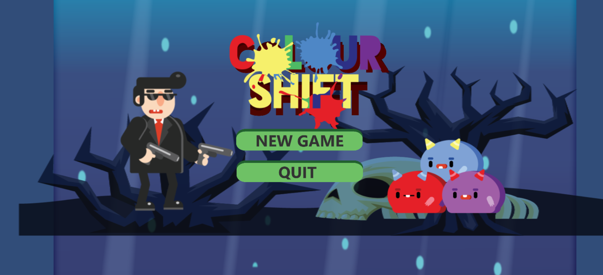
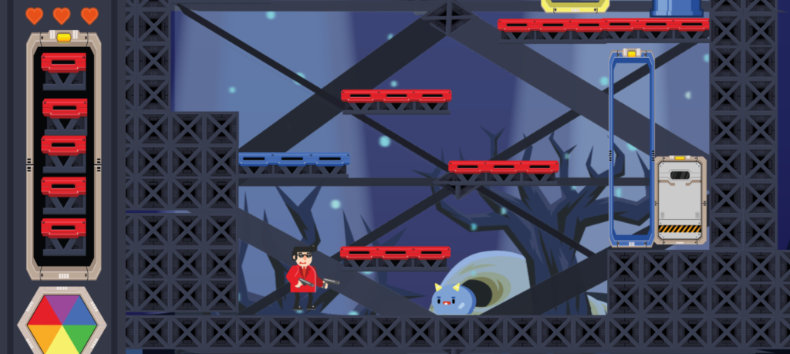
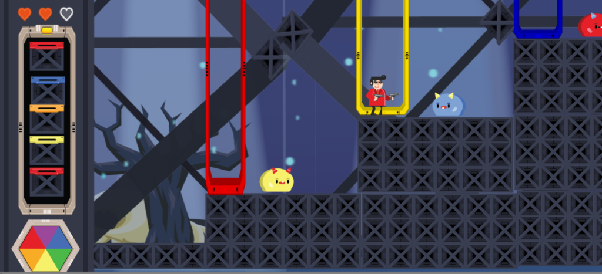

# Color Shift
A Unity game made during a 24 hour game jam (NUS Game Craft 2017) in a team of 5 called Non-Static. At the start of the event, a theme was given which the game created would revolves around. The theme that was issued was "Shift".

## Game Overview
Click on the ColourShift.exe file to play. Alt + F4 to quit the game.

Synopsis: Reach the white door. You can extract colours out of 'keys' and enemies where they can be used as ammunition to shoot enemies or colour your suit You can only pass by gates of the same colour of your suit and can only kill enemies by turning them white. This can be done by painting them with complementary colours. You have 3 lives. When you receive damage, you turn invulnerable for 1 second.

White cannot be merged with anything. Primary colours can be merged with other primary colours except itself to obtain a secondary colour or the complementary secondary colour to obtain white. Secondary colours can be mixed with other secondary colours or the complementary primary colour to obtain white. Merging will combine your top two blocks in your stack.

Controls Left Shift- Pour on your head Z - Shoot X - Extract C - Merge the top two colours in your stack (if they are mergable) Up Arrow - Jump Left/Right Arrow - Move Left/Right

*Level 1*

*Level 2*
